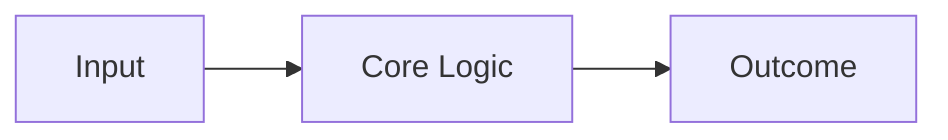

# [Project Title]

> **[Short, punchy catchphrase describing the project's essence]**

---

## 🔍 The Problem

[A clear, concise description of the real-world challenge this project addresses. Focus on the impact—whether it's a security vulnerability, an operational inefficiency, or a safety risk.]

## 💡 The Solution

[Explain how this project solves the problem. Highlight the core innovation and the value it brings to the user or organization.]

## 🛠 Tech Stack

- **Core**: [Primary language/framework]
- **Specialization**: [Security/Optimization/Protocol]
- **Infrastructure**: [Docker/Cloud/CI-CD]
- **Principles**: [Zero Trust/Agile/Clean Code]

## ⚙️ Operational Logic

[Briefly explain the underlying mechanics. How does the system process data or handle its primary task?]

1. **[Phase 1]**: [Description]
2. **[Phase 2]**: [Description]
3. **[Phase 3]**: [Description]

---

### 🛡️ Design Philosophy

[Optional: Mention core principles like 'Security by Design', 'Resilience', or 'Efficiency First'.]

### 🏗 Architecture Overview

### 📧 Contact & Collaboration

[Your professional contact details or links.]
